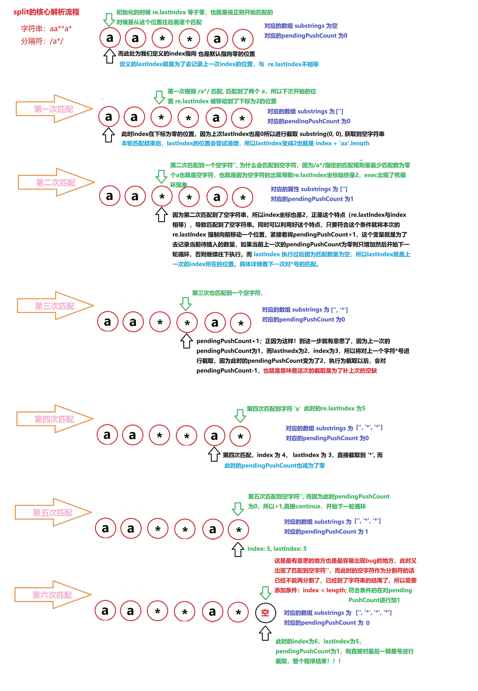

# js-create-split

手写完美实现JavaScrtipt的split方法，支持正则分隔符，通过测试用例

## String.prototype.split

### 关于split的使用

#### 参考 [MDN String.prototype.split()](https://developer.mozilla.org/zh-CN/docs/Web/JavaScript/Reference/Global_Objects/String/split)

##### 1. split 方法使用指定的分隔符字符串将一个 String 对象分割成子字符串数组，以一个指定的分割字串来决定每个拆分的位置

##### 2. 综上所述可以了解到 split 主要是用来根据指定的分割字符串来分割目标字符串

##### 3. 参数有两个, 分别是分隔符(separator) 和 最大分割片段数量(limit)

##### 4. separator 可以是字符串和正则表达式, 如果为空字符串, 则将str原字符串中每个字符的数组形式返回

### 深入了解split

#### 参考 [ecma262 sec-string.prototype.split](https://tc39.es/ecma262/multipage/text-processing.html#sec-string.prototype.split)

##### 1. 分割规则是从左向右开始分割的

##### 2. 如果操作的对象(不一定是字符串), 如果是null或者undefined 会抛出TypeError

```javascript
  String.prototype.split.call(undefined)
  String.prototype.split.call(null)
  // 上述操作会报错
  Uncaught TypeError: String.prototype.split called on null or undefined
```

##### 3. 如果separator是 undefined, 直接返回当前字符串

```javascript
   //期望返回 ["", ""], 
  // 但实际上返回 ["undefined"]
  'undefined'.split(undefined); 

  // 可以通过下面这种方法得到正确的结果
  'undefined'.split(/undefined/);
  // 或者
  'undefined'.split('undefined');
```

##### 4. 如果操作的对象是一个空字符串, 则返回一个空数组

```javascript
  ''.split('') // []
```

##### 5. 如果separator的长度等于零(空字符串),则将字符串的每一项添加到数组中并返回

```javascript
  '1,2,3'.split('') // ["1", ",", "2", ",", "3"]
```

##### 6. 如果没有提供limit, 则最大分割片段数量为数组的最大长度(2的32次方-1) (Math.pow(2, 32) - 1)

##### 7. 因为分割符支持正则如果涉及组捕获, 则同时也会将分组捕获到的内容放入到数组中.

###### 分隔符只可以是字符串情况的模拟

```javascript

  // ...
  // check code
  // ...

  // 核心代码
  let r = new String(separator); // 分割符
  let i = 0;
  let j;
  let substrings = [];
  while((j = s.indexOf(r, i)) != -1) {
    substrings.push(
      s.substring(i, j)
    );
    if(substrings.length >= limit) {
      return substrings;
    }
    i = j + separatorLength;
  }
  // 捕获最后一个分隔符右边的字符串
  substrings.push(
    s.substring(i)
  );

```

核心思路就是通过建立循环不断查找'分割符'在字符中首次出现的位置, 并且不断更新字符串查找的开始位置, 直到找不到分隔符为止.

### 完美实现

#### 如何实现可以匹配带正则的分隔符?

##### 思考: 可以尝试将传进来的字符串转成一个同等字符串正则表达式

###### 比如

```javascript
  // 举例一
  'foo,bar'.split(',')
  // => 可以理解为:
  'foo,bar'.split(/,/)

  // 举例二
  'foo-bar'.split('-')
  // => 可以理解为:
  'foo-bar'.split(/-/)
```

###### 实现

```javascript
  new RegExp(',') => /,/
  new RegExp('-') => /-/
  new RegExp('+') => /,/
```

具体实现的时候会发现出现一种问题, 如果传入的分隔符字符串是正则中的匹配符怎么办, 比如这种情况

```javascript
  new RegExp('+') => /+/ // 这种正则肯定不可以用的
  /+/.exec('+'); // Invalid regular expression: /+/
```

其实有一种解决方案, 在看尤大大的Vue源码时, 发现它在处理 自定义分隔符 delimiters 时, 是这样来解决这个问题的

参考 [vue 编译模块的 text-parser.js](https://github.com/vuejs/vue/blob/dev/src/compiler/parser/text-parser.js)

```javascript
const regexEscapeRE = /[-.*+?^${}()|[\]\/\\]/g
// 根据用户提供的分隔符动态生成正则表达式
const buildRegex = cached(delimiters => {
  // 目的是为了在生成 RegExp 的时候转义那些在正则中有冲突的字符
  // $&：匹配的子字符串。
  const open = delimiters[0].replace(regexEscapeRE, '\\$&')
  const close = delimiters[1].replace(regexEscapeRE, '\\$&')
  return new RegExp(open + '((?:.|\\n)+?)' + close, 'g')
})
```

可以看出作者的具体解决思路就是, 通过建立一个正则, 这个正则包含了所有可能会产生冲突的正则匹配符号, 然后对传进来的字符串进行replace成转译后的结果.

```javascript
  // r: 传进来的字符串分隔符
  const regexEscapeRE = /[-.*+?^${}()|[\]\/\\]/g;
    separatorRE = new RegExp(r.replace(regexEscapeRE, "\\$&"), "g");
```

看到我后面加了g, 是因为下面通过正则的 exec 进行循环匹配的时候必须保证是全局匹配, 才可以实现处理所有的分隔符而不是首个.

##### 思考: 可以借照前面字符串的循环处理逻辑, 不断匹配符查找匹配符的位置, 直到匹配不到为止

```javascript
  let lastIndex = (separatorRE.lastIndex = 0);
  let match,
    index = 0;
  let substrings = [];
  while ((match = separatorRE.exec(s))) {
    index = match.index;
    substrings.push(s.substring(lastIndex, index));
    // check limit
    if(substrings.length >= lim) {
      return substrings;
    }
    // 处理组匹配
    if (match.length > 1) {
      substrings = substrings.concat(match.slice(1));
    }
    lastIndex = index + match[0].length;
  }

  // No match left
  if (index < s.length) {
    substrings.push(s.substring(lastIndex));
  }
```

本来觉得这段代码已经可以的时候, 通过测试以下案例整个程序直接崩了!!!

```javascript
  const separator = /a*/;
  let str = 'a**aa*';

  // 直接死循环
```

后来通过debugger, 发现匹配的时候, 第一次没有问题, 第二次匹配到的一直时空字符串(''), separatorRE.lastIndex 就会一直在哪个位置不动(因为没有匹配到任何东西), 并且特征是 separatorRE.lastIndex 与 index 相等.

通过思考, 修改代码如下

```javascript
  let lastIndex = (separatorRE.lastIndex = 0);
  let match,
    index = 0,
    len = s.length, // ++++ add Code
    pendingPushCount = 0; // ++++ add Code
  let substrings = [];
  while ((match = separatorRE.exec(s))) {
    index = match.index;

    // ++++ add Code
    if (separatorRE.lastIndex === index) { 
      ++separatorRE.lastIndex;
      if (index < len && !pendingPushCount++) {
        continue;
      }
    }
    substrings.push(s.substring(lastIndex, index));
    // check limit
    if(substrings.length >= lim) {
      return substrings;
    }
    if (match.length > 1) {
      substrings = substrings.concat(match.slice(1));
    }
    lastIndex = index + match[0].length;
    if (pendingPushCount > 0) { // ++++ add Code
      --pendingPushCount;
    }
  }

  // No match left
  if (index < s.length 
  || pendingPushCount > 0 // ++++ add Code
) {
    substrings.push(s.substring(lastIndex));
  }
```

通过增加 pendingPushCount, 顺利解决问题.

核心思路就是：只要发现 separatorRE.lastIndex 与 index 相等, 则就说明匹配的一定是空字符串, 通过强制移动 separatorRE.lastIndex 的位置, 并且待插入的数量, 如果在本次处理前没有任何待插入的数量,则直接返回等待下次匹配到再执行插入(因为此时的lastIndex还是上次的lastIndex), 没执行插入一次旧对修改待插入的数量.

如果匹配结束, 仍有待插入数量, 执行插入即可.

详细案例解析流程

